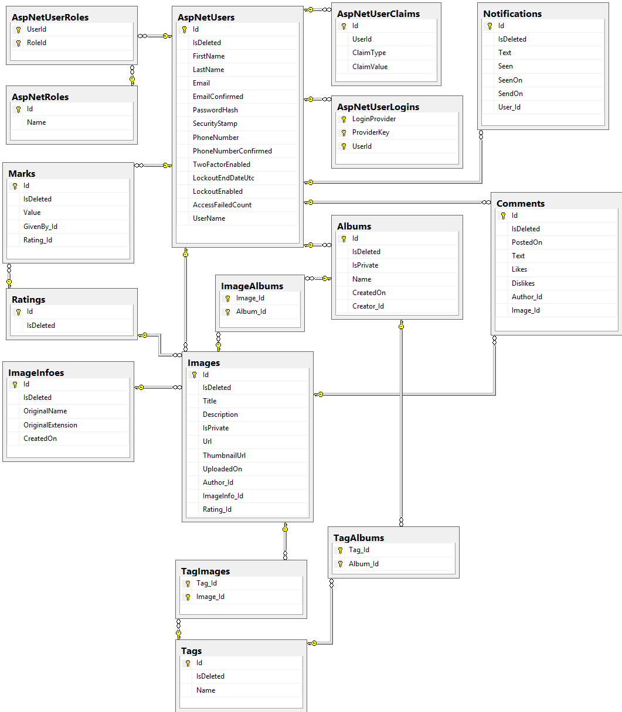

## Team Kratos

- **Ivo Paunov** - @Github: [Ivo Paounov](https://github.com/IvoPaunov), @Telerik Academy: [ivo.paunov](https://telerikacademy.com/Users/ivo.paunov)
-  **Veselin Tsvetanov** - @Github: [Veselin Tsvetanov](https://github.com/veselints), @Telerik Academy: [veselints](https://telerikacademy.com/Users/veselints)
-  **Andrey Mitev** - @Github: [Andrey](https://github.com/AndrewMitev), @Telerik Academy: [AndreyMitev93](https://telerikacademy.com/Users/AndreyMitev93)
-  **Ventsislav Ivanov** - @Github: [DJBuro](https://github.com/DJBuro), @Telerik Academy: [ventsislav.a.ivanov](https://telerikacademy.com/Users/ventsislav.a.ivanov)
-  **Tsvetan Razsolkov** - @Github: [Tsvetan Razsolkov](https://github.com/TsvetanRazsolkov), @Telerik Academy: [cecunqk](https://telerikacademy.com/Users/cecunqk)

## [pSher](https://github.com/Kratos-TA/pSher)

[pSher](https://github.com/Kratos-TA/pSher) is a sample photo share system for Telerik Academy Web Services and Cloud Technologies course.
  This application provides functionality for the user to upload hers/his favourites pictures and to share them with other people around the world. All users have their own accounts, can view other users' pictures, leave a comment or like them.

[pSher](https://github.com/Kratos-TA/pSher) provides full support for CRUD operations - some of them: registration, login, showing / creating / updating / deleting / commenting / liking / filtering / searching uploaded images.

**RESTful application powered by:**

- [ASP.NET WebAPI](http://www.asp.net/web-api) - Repository Pattern + Service Pattern + dependency resolver (Ninject)
- [Microsoft SQL Server](http://www.microsoft.com/en-us/server-cloud/products/sql-server/)
- [SammyJS](http://sammyjs.org/)
- [Bootstrap](http://getbootstrap.com/)
- [jQuery](http://jquery.com/)

**APIs:**

- [Pubnub](http://www.pubnub.com/) - Simple and Real-time Communications API
- [GoogleDrive](https://developers.google.com/drive/v2/reference/) - Google Drive file management API

## Entity Relations diagram

## API Methods

##### Users #####
- **api/account/register - POST** - Registers a user.
- **api/account/logout - POST** - Logs user out.
- **api/users/login - POST** - Logs a user in and returns unique user access token.
- **api/users/{name} - GET** - Returns information about the first user with the specified name - id, username, first name, last name, email and a collection of the user's images.
- **api/users/{id} - PUT** - Updates information about the user with corresponding id - first name, last name and/or email address.
- **api/users/{id} - DELETE** - Deletes the user with corresponding id, all of hers/his albums and images(not from the database).

##### Albums #####
- **api/albums/ - GET** - Returns first 10 non-private albums sorted by name.
- **api/albums/{id} - GET** - Returns the album with the corresponding id, if it is not private or is requested by the user that created it. Else returns error message.
- **api/albums/?name=…&user=…&tags=…&page=…&pageSize=…  - GET** - Returns paged non-private albums, according to the specified parameters and ordered by album name.
- **api/albums - POST** - Creates new album.
- **api/albums/{id} - PUT** - Changes the album with the specified id.
- **api/albums/{id} - DELETE** - Deletes the album(not from the database).

##### Comments #####
- **api/comments - POST** - Creates a comment for a specified image from the logged in user.
- **api/comments/{id} - PUT** - Adds like or dislike to a specified comment.
- **api/comments{id} - DELETE** - Deletes the specified comment.

##### Images #####
- **api/images - GET** - Returns first 10 images ordered by date of uploading.
- **api/images/{id} - GET** - Returns the image with the specified id.
- **api/images?name=...&tags=...&page=...&pageSize=... - GET** - Returns paged non-private images, according to the specified parameters and ordered by date of uploading.
- **api/images - POST** - Creates new image.
- **api/images/{id} - PUT** - Receives an image model and updates the coresponding image in the database.
- **api/images/{id} - DELETE** - Deletes the image(not from the database).

##### Marks #####
- **api/marks - POST** - Creates new mark for a specified image with a specified value from the currently logged in user.
- **api/marks/{id} - PUT** - Changes the value of the mark with corresponding id.
- **api/marks/{id} - DELETE** - Deletes the mark with the specified id(not from the database).

## GitHub repository link - [pSher](https://github.com/Kratos-TA/pSher)

## [Original task requirements and description](https://github.com/TelerikAcademy/Web-Services-and-Cloud/tree/master/Teamwork)